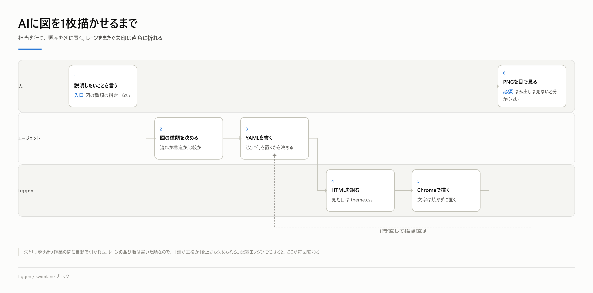
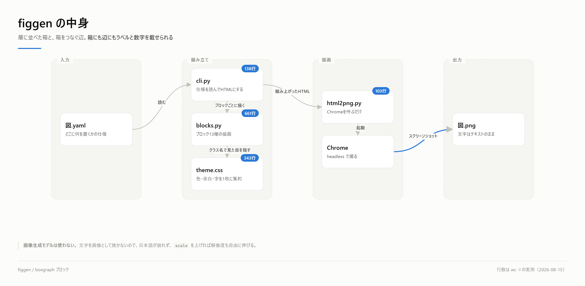
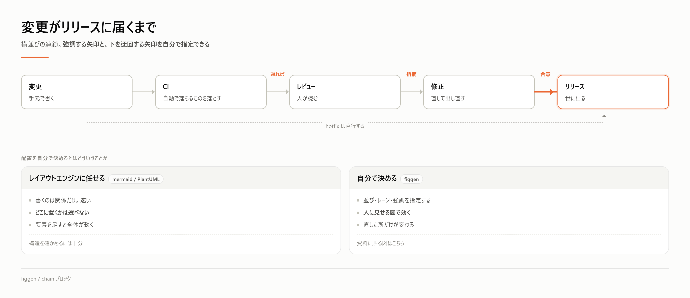

# figgen — YAMLから説明図を出す

スライドや報告に貼る説明図を、YAMLの仕様1枚から作る。文字は画像として焼かず、
レイアウトはHTML/CSSで持ち、描画だけを Chrome に任せる。

```bash
pip install figgen
```

```bash
figgen 図.yaml          # 同じ場所に 図.png と 図.html を出す
figgen 図.yaml --html   # HTMLだけ（速い。中身の確認用）
figgen fig*.yaml        # まとめて
```

clone しただけで動かすなら `python draw.py 図.yaml`（中身は同じ）。

必要なもの: Python 3.9以上 と **Chrome か Edge**。npm もビルドも要らない。
Chrome は描画にだけ使う（pip では入らないので、無ければ入れる）。
場所を変えたいときは環境変数 `FIGGEN_CHROME`。

```bash
python doctor.py    # 足りないものを挙げ、見本を1枚実際に描いて確かめる
```

**「入っているか」を数えるだけの点検はしない。** 最後に必ず1枚描かせて、
`figgen は使える。` が出れば本当に使える。

## 何が出るか

**担当ごとのレーンに分けた流れ。** レーンの並び順は書いた順で、
レーンをまたぐ矢印は直角に折れる。戻る矢印（`loops`）も自分で指定する。



**層に並べた箱と、その継ぎ目。** 箱にも辺にもラベルと数字を載せられるので、
「どこが太いか」をあとから重ねられる。



**強調する矢印と、下を迂回する矢印。** どの矢印を太くするか、
どこからどこへ近道を引くかを、こちらが決める。



仕様はそれぞれ [`examples/`](examples/) にある。**全13ブロックを1枚に並べた見本**は
[`examples/全ブロック.yaml`](examples/全ブロック.yaml)。

## なぜ作ったか

画像生成モデルは日本語の文字を崩す。一方 mermaid・PlantUML・Graphviz 系は文字は正確だが、
**どこに何を置くかを自分で決められない**（配置エンジンが勝手に置く）。既存のYAML→図のOSSを
一通り見たが（drawthe.net / diagrams-as-code / yml2dot / infrastructure-diagrams 等）、
どれもインフラ構成図の生成が目的で、Graphviz にレイアウトを任せる作りだった。

説明図でこちらが決めたいのは、まさにその配置のほう。だから配置はCSSグリッドで持ち、
図の中身はYAMLで持ち、描画をChromeに任せる薄い道具にした。

- 文字が崩れない。テキストのまま置くので、解像度も自由（`scale`）
- 直せる。1行直して再実行すれば1秒で出る。画像生成のように全部描き直しにならない
- 数字が嘘にならない。散布図などはデータのJSONから描くので、手で置いた点にならない
- 見た目が揃う。色・余白・字は `theme.css` の1枚に集約してある

## 仕様（YAML）の書き方

```yaml
title: 図の見出し
subtitle: 小見出し
footer: 左下に出る文字
source: 右下に出る文字（出典）
width: 1600        # 内部の設計幅。既定 1600
scale: 2           # PNGの倍率。既定 2（=3200px幅）
height: 900        # 書くと固定キャンバス。省くと内容の高さに合わせて切る
accent: blue       # blue | orange
blocks:
  - type: ...
```

本文で使える記法は3つだけ。`**太字**` ／ `` `コード` `` ／ `[[アクセント色]]`。改行はそのまま改行になる。
Markdownを全部通すと図の中で崩れるので、意図的にこれだけにしてある。

## ブロック一覧

| type | 何を出すか |
|---|---|
| `banner` | 全幅の帯。転回点や結論を1行で |
| `steps` | 番号付きの横フロー |
| `chain` | 横並びの連鎖。矢印つき。強調と迂回を指定できる |
| `columns` | N列のパネル。2案の比較に |
| `callout` | 強調の1枚 |
| `metrics` | 大きな数字の並び |
| `table` | 表 |
| `note` | 小さい注記 |
| `swimlane` | 担当（レーン）を行、作業の順序を列に置く |
| `boxgraph` | 層に並べた箱と、箱をつなぐ辺。箱にも辺にもラベルと数字が載る |
| `graph_pair` | 2つのグラフ（ノード＋辺）を並べる |
| `scatter_pair` | 同じ点集合を2通りに囲う |
| `spacer` | 余白 |

**各ブロックのキー・記法・落とし穴は
[`src/figgen/BLOCKS.md`](src/figgen/BLOCKS.md) にまとまっている。**
ここが YAML 方言の正本で、MCP の `figgen_blocks` もこれを返す
（同じことを2か所に書くと必ず片方が古くなるため、一本にしてある）。

## AIエージェントから使う（MCP）

**figgen の弱点は「独自YAML方言を13ブロックぶん覚えないと書けない」ことだった。**
MCP 越しに使うなら覚えるのはエージェントなので、その弱点が消える。
人は「こういう図が欲しい」と言うだけでよくなる。

```bash
pip install "figgen[mcp]"     # MCPサーバーは Python 3.10 以上
```

Claude Code / Claude Desktop などの設定に足す:

```json
{
  "mcpServers": {
    "figgen": { "command": "figgen-mcp" }
  }
}
```

道具は2つだけ。

| 道具 | 何をするか |
|---|---|
| `figgen_blocks` | YAML方言（全13ブロックのキー・記法・落とし穴）を返す。**図を書く前に呼ぶ** |
| `figgen_render` | YAMLの仕様を PNG にする。仕様は `.yaml` として隣に残る |

`figgen_render` は PNG と一緒に**仕様の `.yaml` を残す**。figgen は「YAMLが正本、
PNGは生成物」という道具なので、直すときは YAML を1行変えて呼び直す。

> **出た PNG は必ず開いて見ること。** CSS は検証しないので、はみ出し・重なりは
> 見ないと分からない。縦のあふれは警告が出るが、**横のあふれは黙って出る**。

## 色

`theme.css` の先頭にまとまっている。カテゴリ色は blue → orange の順で固定で、順番を入れ替えない。
値は dataviz の検証済みパレットで、`validate_palette.js` の6項目（明度帯・彩度下限・色覚特性下での分離・
通常視での分離・地色とのコントラスト）を全部通したもの。色を足すときは同じ検証を通すこと。

## 制約・分かっている穴

- **横にあふれても警告しない。** 縦のあふれだけは検知して警告する（`height` を省いたとき）
- **1枚に詰めすぎると読めなくなる。** ブロック7つを超えたら2枚に割ることを考える
- 矢印は隣どうしと `bypass` だけ。任意のノード間を結ぶ線は引けない。要るようになったら足す
- フォントは環境依存（游ゴシック→Noto→Meiryo の順）。他のPCで出すと字幅が変わる
- ダークモードは持っていない。スライドに貼る前提で明るい地色だけ

## 置き場所の約束

**図の仕様（`.yaml`）は、その図を使うプロジェクトの側に置く。** この道具の中には置かない。
仕様はプロジェクトの資料であって、道具の一部ではないため。

```
your-project/
  docs/figures/アーキテクチャ.yaml     ← 仕様はここ。図と一緒に版が進む
  docs/figures/アーキテクチャ.png      ← 生成物
```

生成された `.html` と `.png` は生成物なので手で編集しない。直すのは `.yaml` か `theme.css`。
